# CPAL — Component Walkthrough (algorithmic process, explained)

_A detailed, plain-language walk through every component of the CPAL analysis
pipeline, with a screenshot of each one from the live wireframe
(`tutor.cpaltutor.com/wireframe`). Read this as if someone is explaining the
system to you for the first time._

---

## 0. The big picture

CPAL is a Java tutor that reads **how deeply a student understands code**, not
just whether they're right. The same Hello World program is shown two ways: the
**Student** tab is the plain Socratic chat the learner sees; the **Teacher** tab
is the live analysis behind every message.

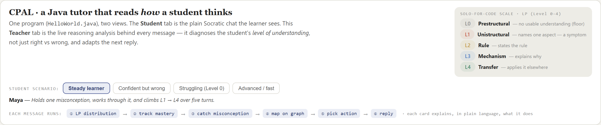

Every time the student sends a message, **six things run in order** and all the
Teacher panels recompute at once:

> ① diagnose the level → ② track mastery → ③ catch the misconception →
> ④ place it on the knowledge graph → ⑤ pick the teaching action → ⑥ write the reply.

### What the student sees (the input side)

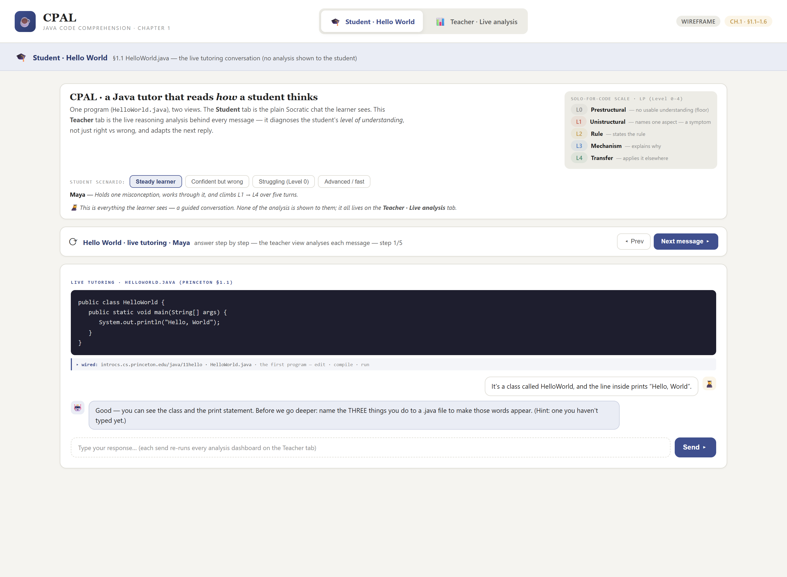

### What the teacher sees (the whole analysis at once)

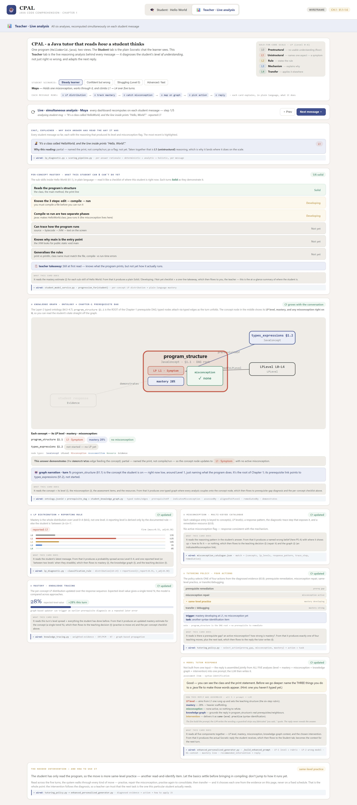

---

## 1. ① LP diagnosis — *how deep is the understanding?*

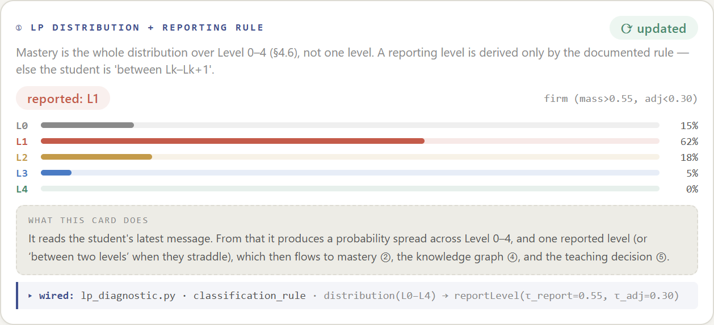

**What it is.** The Learning Progression places the answer on a five-level
SOLO-for-code scale: **L0 prestructural (floor) → L1 unistructural/symptom →
L2 rule → L3 mechanism → L4 transfer.**

**The algorithm (`lp_diagnostic.py`, `classify_lp_level`).**
1. The student's text is turned into features and encoded by the **HVSAE**
   autoencoder into a latent vector.
2. That latent + surface features are scored against the **per-level rubric
   descriptors** for the concept — each level gets a score.
3. A second pass (`classify_post_reply`) adjusts the level with **heuristic
   corrections**: a *substance penalty* (vague answers drop), a *mechanism-vocab
   bump* (using words like "bytecode/JVM" lifts toward L3), a *parroting
   downgrade* (repeating the prompt doesn't count), and a *transfer upgrade*.
4. The result is **not one level but a probability distribution over L0–L4** —
   because learners genuinely sit *between* levels.

**The reporting rule.** A single "reported level" is shown only when one level's
probability mass is high enough and clearly separated:
`report Lk if mass(Lk) > 0.55 and adjacent mass < 0.30, else "between Lk–Lk+1."`
In the screenshot the spread is L1 62% → reported **L1 (firm)**.

**Cost:** one encode + a scan over the rubric levels per turn — O(levels).

---

## 2. ② Mastery — *how much have they actually mastered?*

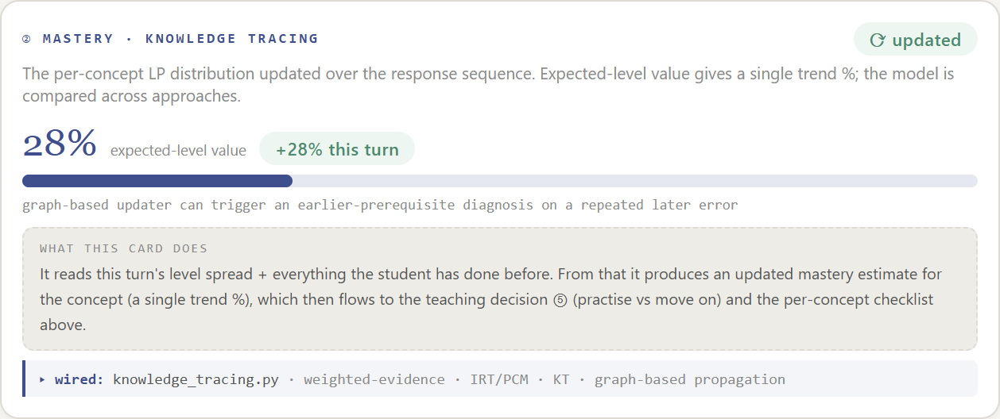

**What it is.** A running estimate of mastery for the concept across the whole
conversation, not just this answer.

**The algorithm (`dina.py`, DINA model).** DINA = *Deterministic Input, Noisy
And.* Each concept has required skills (a Q-matrix). Given the student's latent
skill state, the model predicts the probability of a correct response, allowing
for a **slip** (knows it, answers wrong) and a **guess** (doesn't know it,
answers right). After each turn the correctness updates the posterior mastery
probability. The wireframe also shows an **expected-level value** (the mean of
the L0–L4 distribution) as a single trend %. A graph-based variant can propagate
a repeated later error back to an earlier prerequisite.

**Cost:** O(1) per skill per update.

---

## 3. ③ Misconception — *what specific wrong belief is in play?*

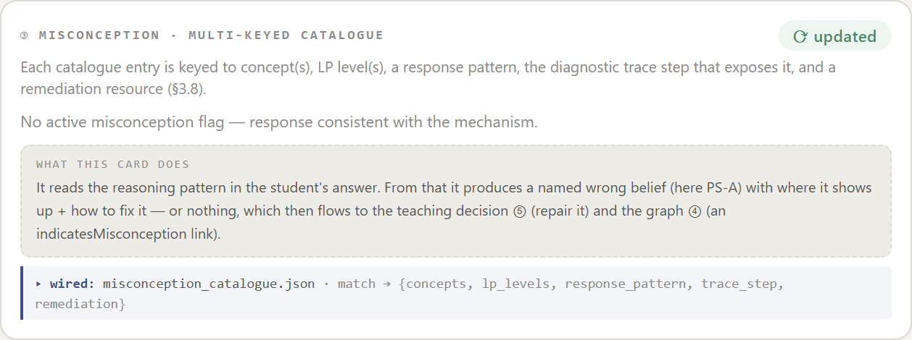

**What it is.** A named wrong belief from the catalogue, **multi-keyed** to the
concept, the LP levels it appears at, the response pattern that betrays it, the
diagnostic trace step that exposes it, and the remediation resource. For Hello
World the key one is **PS-A — "compile and run are one step."**

**The algorithm (`mental_models.py`, `match_wrong_model`).** The response is
matched against concept-keyed catalogue entries (`wrong_models_catalogue_v2.json`).
Each entry carries the wrong belief, its origin, the **signals** that indicate
it, and a grounded **refutation**. A confidence score is computed; the best
match above threshold becomes `wrong_model_id`. Once the student reaches the
mechanism (L3+), a **refutation rule** marks the misconception as cleared.

**Cost:** O(entries for the concept).

---

## 4. ④ Knowledge graph — *where does this sit, and what couples to it?*

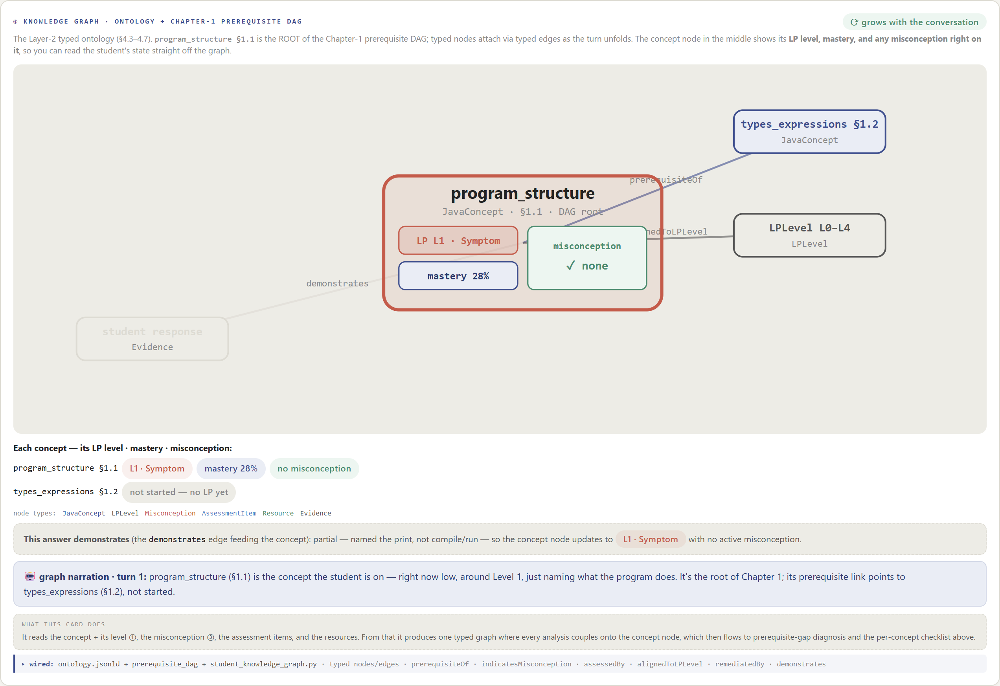

**What it is.** The single place every analysis comes together. `program_structure
(§1.1)` is the **root of the Chapter-1 prerequisite DAG**, and the concept node
carries its **LP level, mastery and misconception right on it** (see the chips in
the centre node). Typed nodes (LPLevel, Misconception, AssessmentItem, Resource,
Evidence) attach via typed edges (`prerequisiteOf`, `alignedToLPLevel`,
`indicatesMisconception`, `assessedBy`, `remediatedBy`, `demonstrates`).

**The algorithm (two parts).**
1. **CSO traversal (`cso_traversal.py`, `get_neighbours`).** An in-memory index
   over `CSO.3.5.nt` exposes the relations (superTopicOf, relatedEquivalent,
   contributesTo…). The concept name is resolved to a CSO slug (`canonical()`
   follows aliases), and 1-hop neighbours are pulled.
2. **Graph update (`student_knowledge_graph.py` → `StudentGraphService.record_turn`).**
   For the touched node it writes the LP level, mastery (with a delta), the
   wrong-models (applying the L3+ refutation rule), the misconception note, and
   the selected intervention; then it adds the typed edges from the 1-hop
   traversal and serializes the graph for the UI. The `demonstrates` edge links
   *this answer* to how the node updated (the line under the graph).

**This is the one true live hook:** the running Gradio app calls `record_turn()`
every turn, so the graph is actually fed by real student turns.

**Cost:** O(neighbours) per turn after the one-time index build.

---

## 5. ⑤ Tutoring policy — *what teaching move next?*

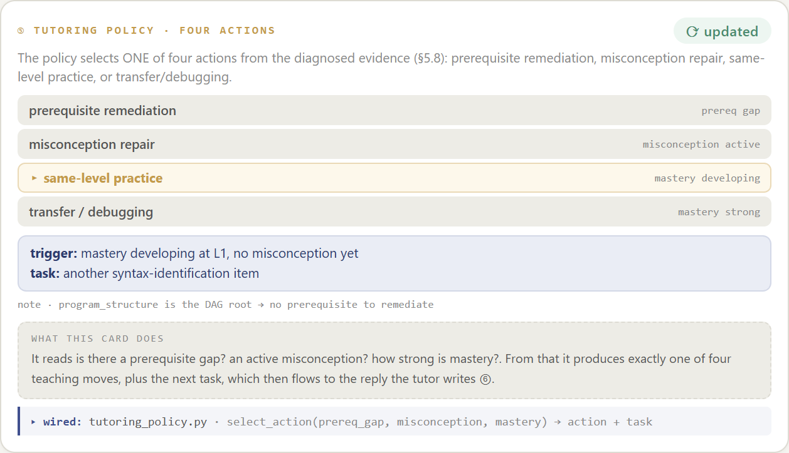

**What it is.** The decision of what to do, as one of **four actions**:
prerequisite remediation, misconception repair, same-level practice, or
transfer/debugging.

**The algorithm (LP gate + RL agent).**
1. A fixed candidate pool of intervention types
   `[transfer_task, worked_example, socratic_prompt, trace_scaffold]` is filtered
   by **`filter_interventions_by_lp(current_lp_level)`** — an LP-validity gate, so
   an L4 move can't be handed to an L1 student.
2. The student's reasoning latent + mastery + emotion + LP form a **state
   vector** fed to the trained **`TeachingRLAgent`** (a DQN). `select_action()`
   returns the argmax-Q intervention.
3. If the RL pick passes the LP gate, it **overrides** the default. The previous
   turn's `(state, action, reward, next-state)` is pushed into the replay buffer
   and one learning step runs — so the agent keeps learning in-chat.

**Honest note:** it gates-and-reranks a fixed four-item pool, and the RL
refinement only applies when the trained agent is loaded; otherwise it falls
back to the LP-gated top pick.

**Cost:** one forward pass per turn.

---

## 6. ⑥ Model tutor response — *how all five become the reply*

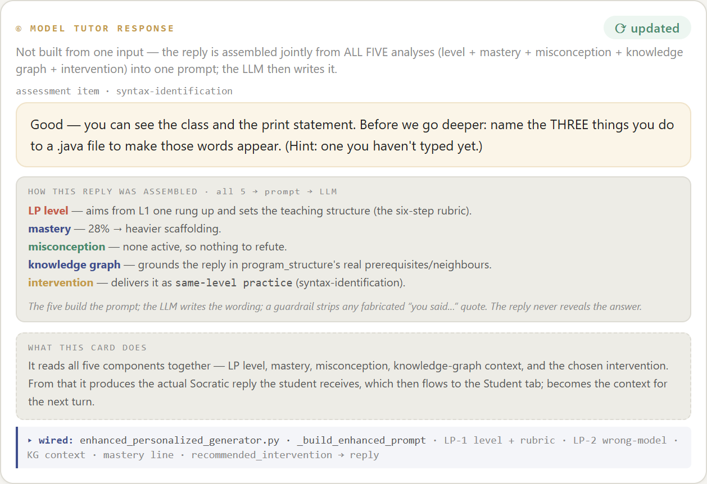

**What it is.** The reply the student actually receives — Socratic, never gives
the answer. Crucially it is **assembled jointly from all five components**.

**The algorithm (`enhanced_personalized_generator.py`, `_build_enhanced_prompt`).**
The five outputs are packed into `student_state` + `analysis` and turned into one
structured prompt:
- **LP level + rubric** → the target level and the LP-3 "six-step" teaching
  structure (what to teach toward, how to phrase it).
- **DINA mastery** → a mastery line that calibrates scaffolding.
- **Wrong-model** → a section that makes the reply refute the belief, grounded
  in the catalogue refutation (+ a guardrail that strips fabricated quotes).
- **Knowledge-graph context** → real prerequisites/neighbours to reference.
- **Intervention** → the move/format (socratic / trace / worked-example / transfer).

The LLM then streams the reply. **The five build the prompt deterministically;
the LLM writes the wording** — so the reply reliably reflects all five inputs but
isn't a fixed template.

---

## 7. Supporting panels (explanation + summary)

**Chat, explained** — every answer with the reasoning that produced its level
and misconception flag:

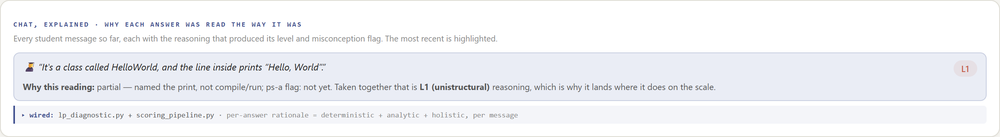

**Per-concept mastery** — the Hello World sub-skills as a plain Solid /
Developing / Not-yet checklist for a teacher:

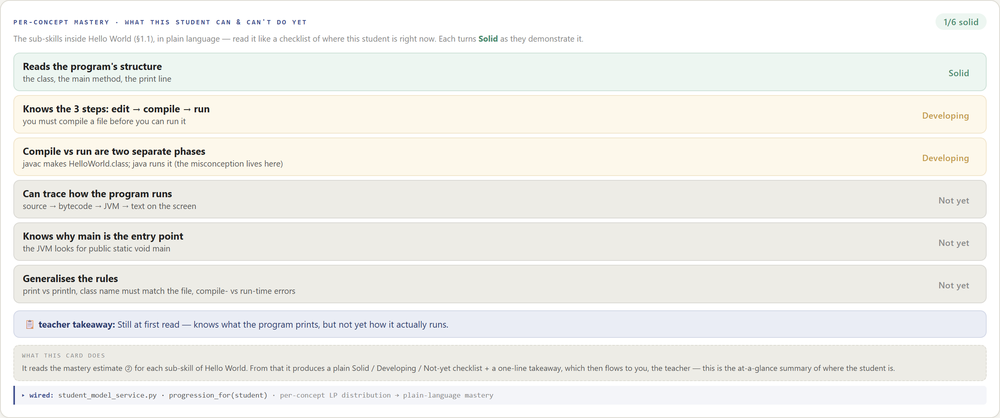

**The needed intervention — how to use it** — the recommended move restated in
plain language with how to apply it:

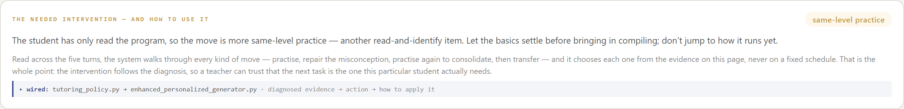

---

## 8. The same process across different students

The wireframe runs the whole pipeline for four scenarios — **steady learner,
confident-but-wrong, struggling at Level 0, advanced/fast** — so you can see the
workflow adapt (the advanced student never grows a misconception node; the
confident-but-wrong student plateaus; the struggling student sits at the L0
floor). Switch them with the **STUDENT SCENARIO** buttons in the header.

---

## 9. One honest caveat

The wireframe is a **static design** (hand-authored examples), and parts of it
follow the Phase-1 **spec** rather than the current code (e.g. the code uses
L1–L4, not the L0 floor; mastery is a single value + DINA, not yet a full
distribution). The component **algorithms above are real** and live in the
codebase; the wireframe shows the intended end-to-end picture, with one genuine
live hook (`record_turn`) feeding the CSO graph from the running app. See
`PROJECT_REPORT.md` §9 for the per-component code locations.
